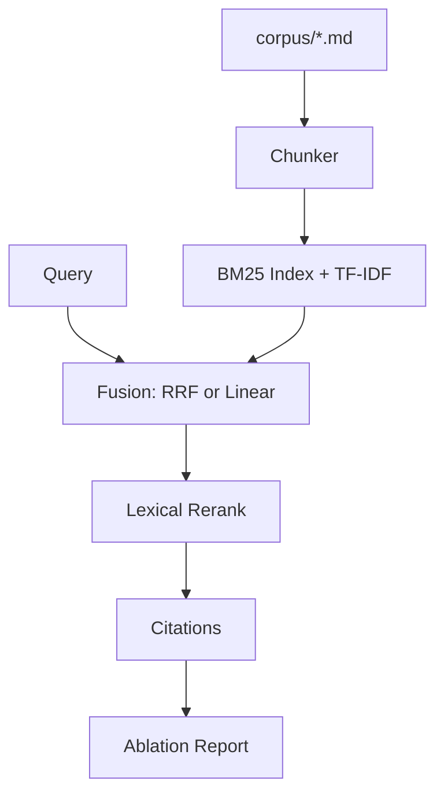

# Hybrid RAG Kit

[](https://www.python.org/)
[](LICENSE)
[](#features)
[](#ablation--metrics)
[](#honest-boundaries)
[](https://github.com/Brian20040323/hybrid-rag-kit)

> A **from-scratch hybrid retrieval pipeline** for modern RAG systems:  
> **chunking → Okapi BM25 → TF-IDF → RRF / linear fusion → light rerank → citations → ablation report**.  
> Zero vector-database dependency. Built to make retrieval quality **measurable**.

**Related repos:** [lite-react-agent](https://github.com/Brian20040323/lite-react-agent) · [mcp-knowledge-bridge](https://github.com/Brian20040323/mcp-knowledge-bridge)

---

## Why this stands out

Vector DBs and embedding APIs are everywhere — but many teams still fail at the basics: **chunking, fusion, and eval**.  
This kit focuses on the parts that actually move RAG quality:

| Feature | Detail | Hot topic |
|---------|--------|-----------|
| **Full pipeline** | ingest → chunk → index → retrieve → cite | Production RAG topology |
| **Hybrid fusion** | BM25 + TF-IDF with **RRF** (default) or linear α | Hybrid search / RRF |
| **Explainable hits** | per-doc `bm25`, `tfidf`, `rrf`, final score | Interpretable retrieval |
| **Ablation harness** | compare fusion modes → Markdown report | RAG evaluation |
| **Source-level metrics** | P@K / R@K / MRR aggregated by document | Offline RAG eval |

---

## Architecture



---

## Quickstart

```bash
git clone https://github.com/Brian20040323/hybrid-rag-kit.git
cd hybrid-rag-kit
pip install -r requirements.txt

python -m examples.demo_search
python eval/run_eval.py
# writes eval/ABLATION_REPORT.md
```

### Python API

```python
from hybrid_rag import RAGPipeline

pipe = RAGPipeline(fusion="rrf")
pipe.ingest_dir("corpus")
result = pipe.answer_with_citations("How does hybrid retrieval help RAG without a vector DB?", top_k=3)
print(result["answer"])
print(result["citations"])
```

---

## Ablation & metrics

`eval/run_eval.py` sweeps fusion strategies and prints / writes:

| fusion | what it tests |
|--------|----------------|
| `rrf` | Reciprocal Rank Fusion (rank-based, α-free) |
| `linear` | α·BM25 + (1-α)·TF-IDF sensitivity |

Metrics: **Precision@K**, **Recall@K**, **MRR** (source-document aggregated).

---

## Honest boundaries

- Sparse hybrid ≠ dense embedding retrieval (no OpenAI/Voyage vectors here on purpose)  
- Lexical rerank ≠ cross-encoder reranker  
- Ideal for **learning, prototyping, interview storytelling**, not replacing enterprise search

If you want the agent layer on top, pair with **lite-react-agent**.  
If you want IDE/tool protocol exposure, pair with **mcp-knowledge-bridge**.

---

## Roadmap

- [ ] Optional dense retriever adapter (plug-in embeddings)  
- [ ] Cross-encoder rerank hook  
- [ ] HTML interactive ablation dashboard  
- [ ] BEIR-style dataset loaders  

---

## License

MIT © Brian20040323
