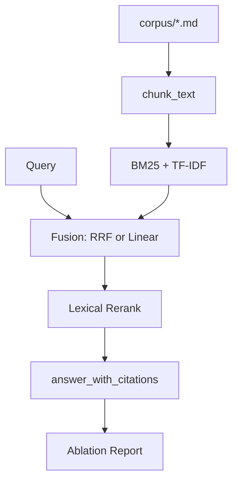

# Hybrid RAG Kit

> 教学/作品集级 **混合检索流水线**：Markdown 切块 · Okapi BM25 · TF-IDF · **RRF / Linear 融合** · 轻量重排 · 引用组装 · **消融评测报告**。  
> 无 Faiss / Chroma / 云向量库依赖。

## 亮点（可写进简历）

1. **完整 ingest→chunk→index→retrieve→cite 管线**，不是单文件 toy search  
2. **RRF（倒数排名融合）** 作为默认融合，并对 `linear(alpha)` 做消融对比  
3. **按 source 文档聚合** 的 P@K / R@K / MRR（chunk 评测更贴近真实 RAG）  
4. **可解释 Hit**：同时返回 bm25 / tfidf / rrf / final score  

## 架构



## 快速开始

```bash
cd hybrid-rag-kit
pip install -r requirements.txt
python -m examples.demo_search
python eval/run_eval.py
# 生成 eval/ABLATION_REPORT.md
```

## 诚实边界

- TF-IDF / BM25 ≠ 生产稠密向量检索  
- 重排是轻量词法加成，不是 Cross-Encoder  
- 适合证明你理解 RAG 评测与融合，而不是替代企业知识库

## License

MIT
